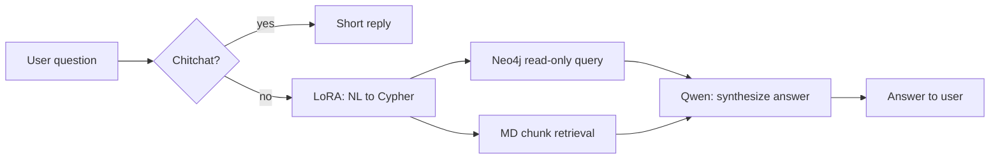

# GraphMuse Copilot

**Hybrid RAG over Neo4j + local Markdown** — a Chinese Q&A demo that maps natural language to **Cypher**, reads structured facts from **Neo4j**, augments with **keyword-based MD retrieval**, and synthesizes answers with **Qwen2.5 + LoRA**.

> **中文**：基于 **Qwen2.5 LoRA + Neo4j + 本地 Markdown 检索** 的混合检索问答；图侧为 **Text2Cypher + 已入库图数据**，与「从文档自动构图」的狭义 **GraphRAG** 范式不同。详细复盘见 [`PROJECT_REVIEW.md`](./PROJECT_REVIEW.md)。



## Features

- **Text2Cypher** via LoRA-tuned Qwen2.5 on `data/gfm_sft.json`-style SFT data.
- **Neo4j** typed schema (`Paper`, `Model`, `Author`, `Dataset`, `Concept`, `Metric`, …) for grounded structured facts.
- **Local MD RAG** (lightweight chunking + keyword scoring) for narrative questions (e.g. methods, contributions).
- **FastAPI** backend + static chat UI; **CLI** variant in `scripts/gfm_neo4j_rag_chat.py`.
- **Safety**: read-only Cypher guard; chitchat routing to skip useless graph hits.

## Requirements

- Python **3.10+** (recommended)
- **PyTorch** with CUDA (inference/training GPU strongly recommended)
- **Neo4j** 5.x (or compatible Bolt endpoint) with your graph **preloaded** from project triples (e.g. `data/**/taskA.json` → your ingestion pipeline; schema described in `PROJECT_REVIEW.md`)
- **Qwen2.5** base weights + trained **LoRA adapter** (e.g. under `outputs/qwen25_gfm_lora/`)

## Quick start (web app)

1. Start Neo4j and load graph data matching the expected schema.
2. Point env vars to your machine (defaults in code assume Linux paths like `/root/llm/...`).

```bash
cd app/backend
pip install -r requirements.txt

export GRAPHMUSE_BASE_MODEL="/path/to/Qwen2.5-7B-Instruct"
export GRAPHMUSE_ADAPTER_PATH="/path/to/GraphMuse/outputs/qwen25_gfm_lora"
export GRAPHMUSE_MD_DIR="/path/to/GraphMuse/md"
export GRAPHMUSE_NEO4J_URI="bolt://localhost:7687"
export GRAPHMUSE_NEO4J_USER="neo4j"
export GRAPHMUSE_NEO4J_PASSWORD="your-password"

uvicorn main:app --host 0.0.0.0 --port 8000
```

PowerShell 下将 `export VAR=...` 改为 `$env:VAR="..."` 即可。

Open **http://localhost:8000** — the API serves the static frontend and endpoints below.

### API

| Method | Path | Description |
|--------|------|-------------|
| `GET` | `/api/health` | Health check |
| `POST` | `/api/chat` | JSON body: `{ "message": "...", "debug": false }` → `answer`, `mode` (`chitchat` \| `graph_rag`), `row_count`, optional `cypher` if `debug` |

> `mode: graph_rag` means **graph query + MD retrieval** in code; naming is historical, not “GraphRAG product” semantics.

## CLI (no browser)

From repo root (install the same stack as backend plus training deps as needed):

```bash
python scripts/gfm_neo4j_rag_chat.py \
  --base_model "/path/to/Qwen2.5-7B-Instruct" \
  --adapter_path "outputs/qwen25_gfm_lora" \
  --neo4j_uri bolt://localhost:7687 \
  --neo4j_user neo4j \
  --neo4j_password your-password \
  --md_dir md \
  --debug
```

Use `--disable_md_rag` for Neo4j-only; `--no_skip_neo4j` forces every turn through the graph path (debug).

## Training (LoRA SFT)

```bash
python scripts/train_qwen25_gfm_lora.py \
  --model_name_or_path "/path/to/Qwen2.5-7B-Instruct" \
  --train_file "data/gfm_sft.json" \
  --output_dir "outputs/qwen25_gfm_lora"
```

See `scripts/train_qwen25_gfm_lora.py` for full flags (`fp16`, gradient checkpointing, LoRA ranks, etc.).

## Repository layout

| Path | Role |
|------|------|
| `app/backend/` | FastAPI service (`main.py`), `requirements.txt` |
| `app/frontend/` | Static chat UI |
| `scripts/train_qwen25_gfm_lora.py` | LoRA fine-tuning |
| `scripts/chat_gfm_lora.py` | Base + adapter chat smoke test |
| `scripts/gfm_neo4j_rag_chat.py` | End-to-end CLI hybrid pipeline |
| `data/` | SFT JSON, `taskA.json` triples per model area, etc. |
| `md/` | Per-model markdown notes for retrieval |
| `outputs/` | Saved adapters (if present) |

## Environment variables (web)

| Variable | Purpose |
|----------|---------|
| `GRAPHMUSE_BASE_MODEL` | Qwen2.5 base model directory |
| `GRAPHMUSE_ADAPTER_PATH` | LoRA adapter directory |
| `GRAPHMUSE_MD_DIR` | Markdown corpus root |
| `GRAPHMUSE_NEO4J_URI` | Bolt URI |
| `GRAPHMUSE_NEO4J_USER` / `GRAPHMUSE_NEO4J_PASSWORD` | Neo4j credentials |

## More documentation

- **[`app/README.md`](./app/README.md)** — compact run notes (env vars; consider aligning wording with this file).

## License

Specify a license in the repository root when you publish (e.g. MIT); none is set here by default.
